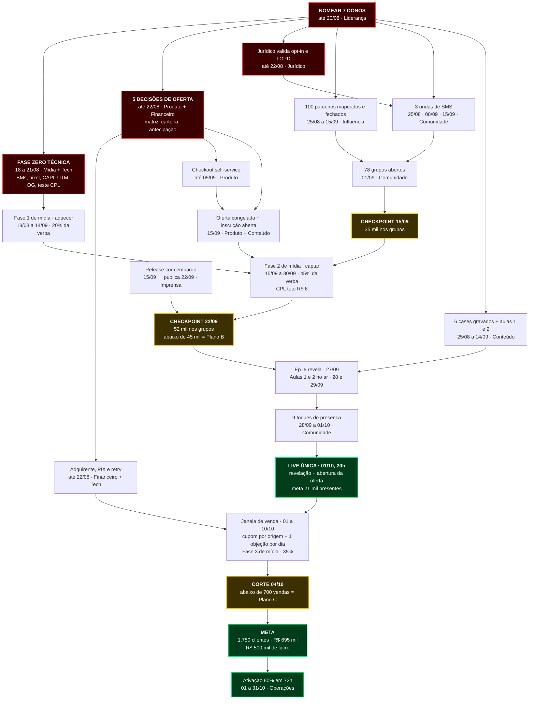

# solvefyfull
estrategia de marketing e lançamento de produto solvefy full
Lançamento Solvefy Full — estrutura de execução
Extraído do deck mestre de 14/08/2026. 75 tarefas, de 18/08 a 31/10.
---
1. O problema antes de qualquer coisa: ninguém tem dono
O deck diz "a definir" em 15 lugares — incluindo os 7 donos de pilar e todos os 7 itens da Fase Zero técnica. A própria página 43 avisa: "Sete donos precisam ser nomeados até 20/08. É a única linha deste deck que não depende de verba nem de produção."
Como hoje é 18/08, isso significa:
A Fase Zero do tráfego venceu hoje (verificar BMs) e vence amanhã (pixel, CAPI, base como público) — sem dono nomeado.
4 das 5 decisões de negócio vencem em 22/08, dentro de 4 dias.
Por isso o CSV usa a coluna Papel em vez de responsável. Nomeie a pessoa de cada papel abaixo e o campo Assignees se resolve numa passada só.
Papel	Tarefas	Nome
Comunidade (P7)	12	
Conteúdo (P2)	12	
Mídia / Tráfego (P3)	10	
Produto / Tech	7	
Liderança / decisão	6	
Produto (oferta e preço)	5	
Imprensa (P1)	5	
Operações / CS	4	
Comercial (997+)	3	
Influência (P4)	3	
Financeiro	2	
Canais (P6)	2	
Jurídico	1	
---
2. Como importar no GitHub Projects
Abra o projeto SOLVEFY FULL — GESTÃO DE PROJETO.
No menu `...` do canto superior direito → Import items (ou "Importar itens").
Suba o `plano-lancamento-solvefy.csv`.
Os campos que você já criou (Status, Prioridade, Tamanho, Data de início, Data prevista) são reconhecidos pelo nome. Dois campos novos são criados na importação:
Papel — a função responsável, para você substituir por nome.
Pilar — os 7 pilares do deck, para agrupar a visão de board.
Depois de importar, crie três visualizações:
Board por Pilar — cada pilar é uma coluna, cada dono vê só a dele.
Roadmap por Data prevista — é aqui que a linha do tempo vira Gantt.
Filtro `Prioridade:Alta` + `Data prevista:<2026-08-25` — o que está queimando esta semana.
> Nota: o campo LEIA-ME do Projects não aceita PDF. Suba o deck no repositório `solvefyfull` e cole o link aqui.
---
3. Caminho crítico
O que está em vermelho no fluxo abaixo é o que trava tudo atrás: sem dono nomeado, a Fase Zero não sai; sem Fase Zero, a Fase 1 de mídia não aprende; sem mídia aprendendo, os 70 mil não enchem; sem os 70 mil, não existe R$ 500 mil de lucro.

---
4. Os quatro portões numéricos
Não são reuniões de status. Cada um tem número e consequência automática.
Data	Número	Se não bater
15/09	35.000 nos grupos	Libera reserva de mídia de R$ 50–60 mil
22/09	52.000 nos grupos	Abaixo de 45 mil ativa o Plano B: upsell para 997 e 2.997 + Produtora
04/10	700 vendas	Ativa o Plano C: antecipação como oferta ativa do checkout
04/11	80% ativados em 72h	É o indicador que prevê o churn de janeiro
---
5. Duas correções que o deck pede e ainda não têm tarefa
Página 08 vs. página 43: a matriz de planos inclui o degrau de R$ 2.997 (criado na revisão de 15/08), mas a tabela de metas por pilar não menciona o dono dele. O dono comercial nomeado em 20/08 precisa absorver a meta de 30 contratos no 2.997.
Página 17: as datas de roadmap (nov/26, dez/26, 1T/27) estão marcadas como proposta e precisam de validação de produto antes de irem a público — mas a objeção "falta a função X" tem peça marcada para 03/10 e depende delas. A validação precisa sair antes de 22/08, não depois.
